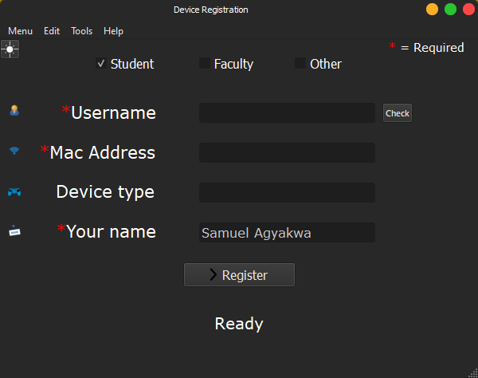
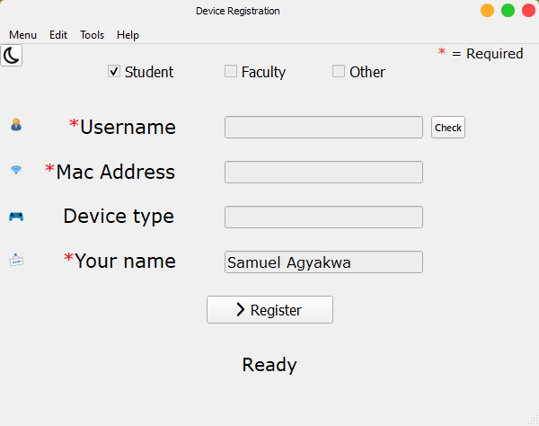

# Device-Registration
## Now Improved!
Automation of the manual addition of MAC addresses on Framingham State's  network for more productivity.
Now uses the requests module to access the fsunac API.

